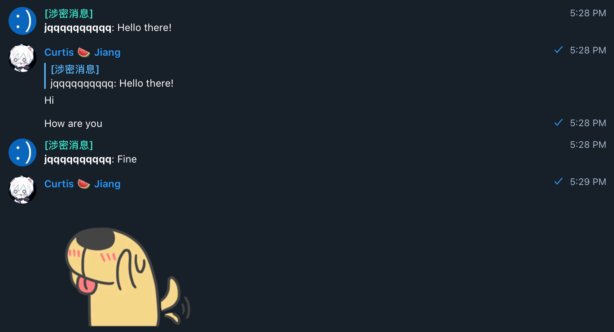
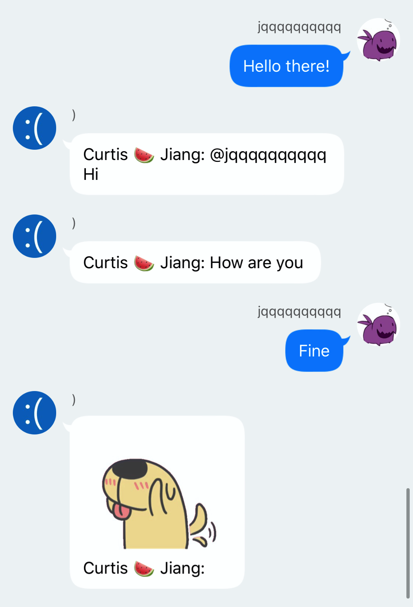

# UnifiedMessageRelay

 [](https://opensource.org/licenses/MIT)

UnifiedMessageRelay is a framework for the purpose of bringing messages from different chat platform together. With UnifiedMessageRelay,
user no longer need to view messages on different platform, or different groups. UnifiedMessageRelay brings powerful
 message forwarding functionality and flexible plugin API to meet your custom need. A driver API specification is also
 provided, so one can compose their own backend driver, and the framework will load and utilize the driver automatically.

## Demo

Telegram:



QQ:



## Supported platforms

- QQ API based on [CoolQ HTTP API](https://github.com/richardchien/coolq-http-api)
- Telegram API based on [aiogram](https://aiogram.dev)

## Features

Limited support for Coolq Air, will update once my Coolq Pro license expires.

## Build Environment

### Use Official Docker

- [coolq/wine-coolq](https://hub.docker.com/r/coolq/wine-coolq/)  *Official Coolq Docker*
- [richardchien/cqhttp](https://cqhttp.cc/docs/4.13/#/Docker) *richardchien's Coolq Docker, with Coolq http api*

The following steps will be based on the *richardchien's Coolq Docker*. Assume `$HOME` is `/root`. Due
 to these dockers are still using old Ubuntu image, python 3.7 is not available in docker. Please run docker 
 and mount data volume, and then run the bot on host os.

### Install CoolQ Docker

```bash
$ cd
$ docker pull richardchien/cqhttp:latest
$ mkdir coolq
$ docker run -ti --rm --name cqhttp-test \
             -v $HOME/coolq:/home/user/coolq \  # mapping $HOME/coolq to docker's coolq directory
             -p 9000:9000 \  # noVNC
             -p 127.0.0.1:5700:5700 \  # HTTP API listen
             -e VNC_PASSWD=MAX8char \  # vnc password, maximum 8 chars 
             -e COOLQ_URL=https://dlsec.cqp.me/cqp-tuling \ # Coolq Pro, for Air user, remove this line
             -e COOLQ_ACCOUNT=123456 \ # QQ Account
             richardchien/cqhttp:latest
```


- Create Coolq http api config (`$HOME/coolq/app/io.github.richardchien.coolqhttpapi/config.cfg`)

```ini
[general]
host=0.0.0.0
port=5700
post_url=http://172.17.0.1:8080
access_token=very
secret=long
post_message_format=array
```

Log in into `http://YOUR_SERVE_IP:9000`, and use the default vnc password `MAX8char` or your own password. You need to
 activate Coolq Pro and log in your QQ Account manually.

### Install python dependencies on host os

Make sure Python 3.7+ and `pip` are installed. Run:

`pip3 install -r requirements.txt`

### Install other required package on host os

`apt install libcairosvg2 ffmpeg`

## Configurations

Create `~/.umr/`

```bash
mkdir ~/.umr
```

Copy config.yaml to `~/.umr`

[Why yaml instead of json?](https://www.quora.com/What-situation-would-you-use-YAML-instead-of-JSON-or-XML)

Example config
```yaml
ForwardList:
  Accounts:  # must specify all available bot account ids for every driver in use
    QQ: 12213312  # your QQ bot account number
    Telegram: 12321312  # your telegram bot chat id
  Topology:  # keep this key even if no topology exists
    - From: QQ
      FromChat: -1123131231  # use negative number for group/discuss, positive for private chat
      To: Telegram
      ToChat: -31231212344  # telegram chat id, use !!id to show
      ForwardType: ReplyOnly
      # OneWay:
      # Forward from "FromChat" to "ToChat"
      # BiDirection:
      # Forward from "FromChat" to "ToChat" and vise versa
      # ReplyOnly:
      # Forward from "FromChat" to "ToChat", ignoring message without "reply_to"
  Default:  # keep this key even if no default route exists
    - From: QQ
      To: Telegram
      ToChat: -123244234234
      # Reply bot message will also reply the source in other platform
Driver:
  QQ:
    Account: 643503161
    APIRoot: http://127.0.0.1:5700/
    ListenIP: 172.17.0.1
    ListenPort: 8080
    Token: very
    Secret: long
    IsPro: yes    # currently coolq air is not supported, image sending is unavailable
    NameforPrivateChat: no  # if destination chat_id is a private chat, show all attributes (sender name, reply to, forward from)
    NameforGroupChat: yes     # if destination chat_id is a group/discuss chat, show all attributes (sender name, reply to, forward from)
    ChatList:
      -1123131231: group       # group/discuss should be negative, type is lower case
      1234423423: private
      -213124432432: discuss
  Telegram:
    BotToken: asdasdsadsadsadsad
DataRoot: /root/coolq/data/image
CommandStart: "!!"
BotAdmin:
  QQ:
    - 123456789
    - 987654321
  Telegram:
    - 213442352354534534
    - 345235345345345345

```

## Start the bot

### Viewing CLI Help

```shell
python3 daemon.py -h
```

### Background process

- Start background service

```shell
python3 daemon.py start
```

or

```shell
python3 daemon.py restart
```

By default, log will be stored in `/var/log/umr/bot.log`

- Stop the background service

```shell
python3 daemon.py stop
```

### Front desk process

If you need to see the log output for debugging purpose, stop the running daemon first. Then follow this command.

```shell
python3 daemon.py run
```

Hit Ctrl + C to stop.

## Commands

### View Commands

Send `!!help` to show available commands.

### Show Telegram Group ID

Send `!!id` in Telegram groups to view Telegram Group ID.

### Update QQ name list

Send `!!name` to update qq name list manually

### Delete QQ Message

Reply to the message you want to delete with `!!del` (message must be sent by bot)

### add telegram blocked keyword

Message containing these keyword will not be forwarded to any other chat

Send `!!bk` and keywords separated by space

### add telegram blocked channel

Message originated from these channel will not be forwarded to any other chat

Reply forwarded channel message with `!!bc`

# Issue Format

## Check these before opening an issue

1. Check if you are using Python 3.7+
2. Check if requirements.txt is installed correctly
3. Check if cq-http-api is enabled in Coolq
4. Check if the log suggests any missing configuration

## Issues must provide

1. Descriptions about the issue
2. Logs of python3 daemon.py run (Desensitization)
3. Which branch you are on (Dev of Master)

